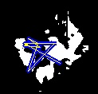
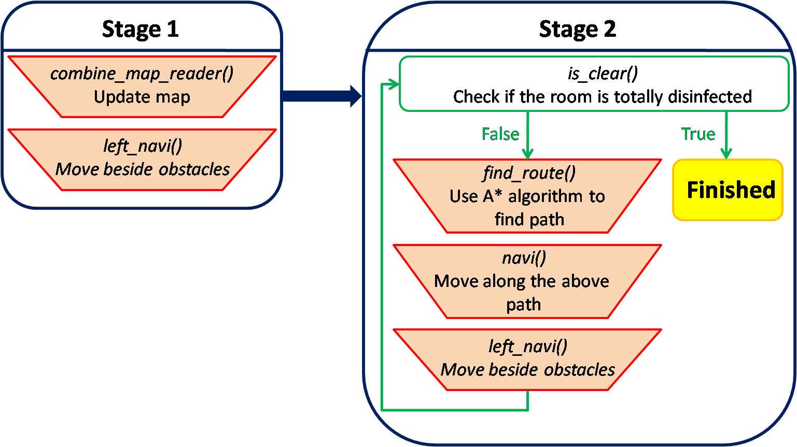

# UV Robotic Challenge - G.L.A.M.O.U.R.o.U.S
2020 UV robot contest.with Micron  
  
**G.L.A.M.O.U.R.o.U.S**  
<em>Germicidal Long-life Autonomous (using Melodic ROS) Overpowered UVC Robot of Unrivaled Supremacy</em>  
  
A UV disinfection robot based on ROS.

## Table of contents
- [UV Robotic Challenge - G.L.A.M.O.U.R.o.U.S](#uv-robotic-challenge---glamourous)
  - [Table of contents](#table-of-contents)
  - [Features](#features)
  - [Environment](#environment)
  - [System architecture](#system-architecture)
  - [Usage](#usage)
    - [Map construction](#map-construction)
  - [Workflow](#workflow)
  - [Vision](#vision)
  - [Mapping](#mapping)
  - [Navigation](#navigation)
  - [Miscellaneous Action](#miscellaneous-action)
  - [Data Flow](#data-flow)
  - [ROS package relationship](#ros-package-relationship)
  - [Dependencies](#dependencies)

## Features
- SLAM and navigation based on depth camera (Intel Realsense D435)
- Collision avoidance
- Human detection
- Voice prompts
- A* seach for path planning
- Remote control by web interface

## Environment
- Raspberry Pi 4B (4G RAM) with Raspberry Pi OS (Debian 10 buster)
- ROS melodic
- Arduino Mega 2560

## System architecture


## Usage
Setup environment
```
$ source ./catkin_ws/devel/setup.sh
```

### Map construction
Build a 2D map of the room.

* Run the following commands respectively.  
```bash
$ roscore
$ roslaunch realsense2_camera opensource_tracking.launch`  
$ rosrun pcl_ros pointcloud_to_pcd input:=/rtabmap/cloud_map  
```
* Hold the camera and turn it around slowly.
* Lots of `.pcd` files will be saved. We only need the lastest one.
* Use `pcd_python.py` to convert 3D pointcloud file to 2D.
* Use `pcd_to_pgm.py` to convert the 2D `.pcd` file to `.pgm` file. 


## Mapping
Mapping can be splited into two main topics: **odometry** and **obstacle**, which both bases on the depth camera. 

**Odometry** represents the **track** of the robot. By getting information from `rostopic` `/rtabmap/localization_pose`, we can connect the previous received point and the present point to get the trajectory of the robot and disinfected area in the room.

**Obstacle** depicts the **contour** of the room, marking where the robot can go. First we receive pointcloud file generated by `pointcloud_to_pcd` node, then we capture the data with height under 1.8 meters (the height of our robot), map the 3D array to 2D, and then smooth our map array.

After dealing with the two topics, we need to **integrate** them. We have a program named `combined_map.py`, which is in charge of the work. It will compare their coordinate systems by overlapping the origin point, adjust the size of the array, and fill in values for each status: '3' for obstacles, '2' for path, '1' for disinfected area, and '0' the rest.

Finally, we get the array with all the information we want, so we can move on to the next part, while the map is simultaneously and continuously updated.

Following is an example visualization image for the combined map, where black indicates obstacles, yellow for path, purple for disinfected area, and white the rest.


## Navigation 



* To ensure the UV robot work properly, users have to place it at a corner of the room. The robot will firstly adjust its direction so that the wall is on the left of itself, and then start to move. The navigation stategy in step1 basicly is to walk along the wall(or the area the robot has sterilized) while simultaneously recording the area the robot can't enter (ex: obstacles), the path the robot has walk through, and the area the robot has sterilized on the map array. The robot will finally stop at a certain position in the room.
* In the step2 the robot will check if there's any area unsterilized on the map array, and then will navigate to the nearest part to sterilized it. The navigatation method in this step is to find the best path with A* algorithm. After entering the unsterilized area, the robot will move in the same manner with that in step1. 
* The robot will perform step1 and step2 alternately until almost every part of the room is sterilized.


## Data Flow (ROS package relationship)

| Autonomous mode                           | Remote-controlled mode                      |
| ----------------------------------------- | ------------------------------------------- |
|  |  |

## Dependencies
- [ROS melodic](http://wiki.ros.org/melodic)
- [librealsense](https://github.com/IntelRealSense/librealsense)
